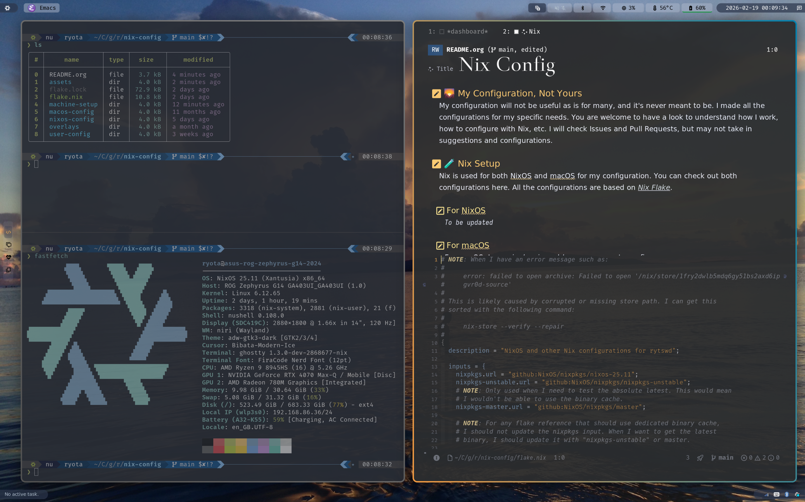

#+title: Nix Config

** 🌄 My Configuration, Not Yours
My configuration will not be useful as is for many, and it's never meant to be. I made all the configurations for my specific needs. You are welcome to have a look to understand how I work, how to configure with Nix, etc. I will check Issues and Pull Requests, but may not take in suggestions and configurations.

** 🧪 Nix Setup
Nix is used for both NixOS and macOS for my configuration. You can check out both configurations here. All the configurations are based on [[https://nixos.wiki/wiki/Flakes][Nix Flake]].

*** For NixOS
For NixOS, I use Nix ecosystem extensively. In order to allow working in various environments, I heavily depend on [[https://github.com/nix-community/home-manager][home-manager]] setup rather than NixOS configuration.

*** For macOS
On my personal macOS machine, I use [[https://github.com/LnL7/nix-darwin][nix-darwin]] together with [[https://github.com/nix-community/home-manager][home-manager]] to manage the full system declaratively.

On my work macOS machine, company policy restricts what can be installed at the system level, so nix-darwin is not an option there. In that more restricted environment I skip the system layer and reuse the raw config files from this repository directly (dotfiles, shell config, etc.), applying only the pieces that do not require elevated privileges.

*** For NixOS with UTM (on Mac)
NOTE: I have not been using this at all, and many of the configurations are broken at this point.
For the UTM setup for VM on macOS, you can find more in [[machine-setup/mbp-utm/README.org]]. Other VM solutions may also be added as I get to test more.

*** Home Manager Standalone
Regardless of the underlying OS, the user-level configuration is managed by [[https://github.com/nix-community/home-manager][home-manager]] in *standalone* mode rather than as a NixOS / nix-darwin module. This keeps user settings decoupled from the system, so updating shell, editor, or CLI tooling never requires a system rebuild or ~sudo~.

#+html:

#+html:
<b>First-time bootstrap with <code>nix run</code></b>

#+html: 

The flake's default app is a one-shot bootstrap that resolves the right ~homeConfigurations~ entry, backs up any conflicting dotfiles, and runs ~home-manager switch~. It assumes only a bare Nix install, so the required experimental features are passed via ~NIX_CONFIG~ (which, unlike the ~--extra-experimental-features~ flag, also propagates to the child ~nix~ processes that ~home-manager~ spawns):

#+begin_src sh
NIX_CONFIG="experimental-features = nix-command flakes pipe-operators
accept-flake-config = true" \
    nix run github:rytswd/nix-config
#+end_src

The bootstrap defaults to the ~coder~ / ~coder-aarch64~ profile based on CPU architecture; that profile reads ~$USER~ / ~$HOME~ at activation time, so it works for whichever user runs it. On any other host, pass the profile explicitly:

#+begin_src sh
NIX_CONFIG="experimental-features = nix-command flakes pipe-operators
accept-flake-config = true" \
    nix run github:rytswd/nix-config \
    -- ryota@asus-rog-zephyrus-g14-2024
#+end_src

#+html:

#+html:

#+html:
<b>Day-to-day updates with <code>hm</code></b>

#+html: 

After the first bootstrap the experimental features are configured permanently, so the ~NIX_CONFIG~ prefix is no longer needed. From a local clone of this repository, the lighter ~hm~ dispatcher resolves the profile from the current user and hostname:

#+begin_src sh
nix run .#hm -- switch
#+end_src

~switch~ is the default subcommand, so this can be shortened further to just ~nix run .#hm~. Use ~build~ for a dry build, or ~profile~ to print the resolved profile name without applying anything.

#+html:

#+html:

#+html:
<b>Reverting</b>

#+html: 

To undo the standalone setup and return the machine to its pre-bootstrap state:

#+begin_src sh
# Unlink every HM-managed dotfile and remove the generation history.
home-manager uninstall

# Drop the side profile that holds HM packages (the host's own default
# nix profile was never touched, so there is nothing to roll back there).
rm -f ~/.nix-profile
rm -f ~/.local/state/nix/profiles/home-manager-packages*
#+end_src

The first bootstrap renamed any pre-existing dotfiles to ~*.hm-bak-<timestamp>~ rather than deleting them; restore those by hand if wanted.

#+html:

** 📜 Configuration Details
The idea is to ensure I have all the ~$HOME~ setup defined declaratively, while allowing some imperative adjustments when and if necessary. Also, it is designed to work with various machines and environments, so that most of the configurations can be shared among the different environments, but still there would be some additional configurations made possible. (Or simply duplicating some resources.)

*** Directories
Most of the configurations are made so that they can be used for various machines and user setup. You can find ~modules/~ directory, where I define specific functionality in a single file, such as ~user-config/modules/music/spotify.nix~.

*** Key Tools In Use
You can find the actual configurations in various ~.nix~ files in this repository. Here is a list of items that are worth clarifying for anyone keen to understand how I work in general.

**** 📝 Editor
I mainly use *Emacs* for any coding tasks, and many more (note taking, task management, email, etc.). All of my Emacs configurations are NOT in this repository, and I manage them in a separate repository (private as of now, maybe to be open sourced in future).
With my Emacs, I use [[https://github.com/emacs-evil/evil][Evil key bindings]] along with Emacs bindings. I use both Emacs and Vi bindings all the time, and thus NeoVim is also another platform I sometimes fall back to. I do have VSCode and other editors installed and use it occasionally, but quite rare in these days.

**** 💻  Terminal
I used to use various solutions, but now my main driver is *[[https://ghostty.org/][Ghostty]]*. It is performant and does everything I need well and cleanly. Before Ghostty, I used to use [[https://github.com/alacritty/alacritty][Alacritty]] and [[https://github.com/tmux/tmux][tmux]], but I do not feel the need anymore. I also have [[https://sw.kovidgoyal.net/kitty/][Kitty]] available, but I do not use it.

**** ⚙️ Core Components
Here is the list of other tools I use for the key components of each OS.
| 🐱                | macOS         | NixOS       |
|-------------------+---------------+-------------|
| Window Management | [[https://github.com/koekeishiya/yabai][yabai]]         | [[https://github.com/YaLTeR/niri][niri]]        |
| Shortcut          | [[https://github.com/koekeishiya/skhd][skhd]]          | [[https://github.com/xremap/xremap][Xremap]]      |
| Toolbar           | macOS default | [[https://github.com/Alexays/Waybar][Waybar]]      |
| App Launcher      | [[https://www.raycast.com/][Raycast]]       | [[https://github.com/davatorium/rofi][rofi]]        |
| Browser           | [[https://zen-browser.app/][Zen Browser]]   | [[https://zen-browser.app/][Zen Browser]] |
